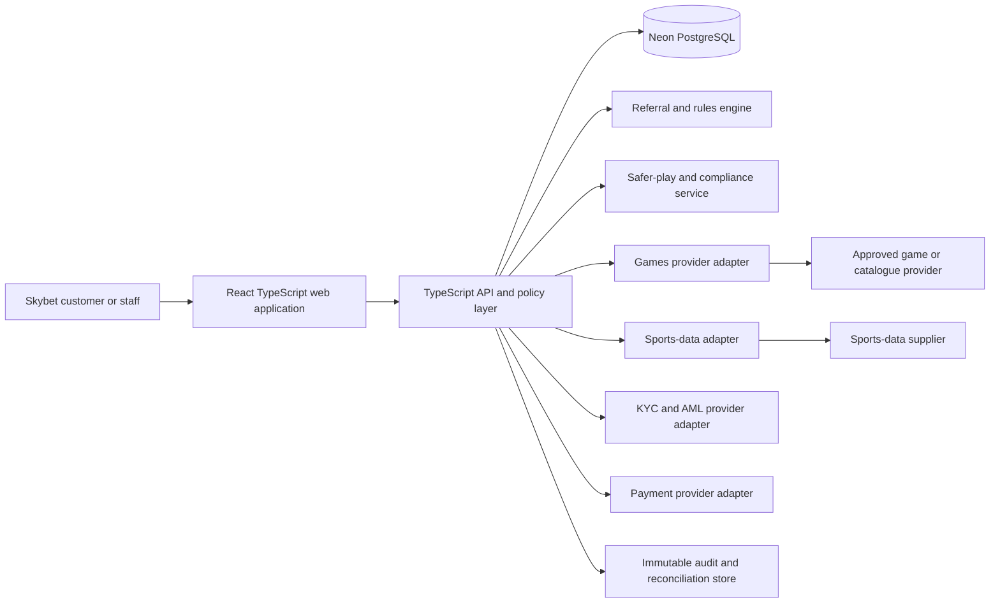

# Skybet Product and Implementation Plan

**Status:** Planning only — no player-facing, payment, wagering, or games-provider functionality will be implemented until this plan is approved and the launch jurisdiction is confirmed.

**Prepared by:** Manus AI  
**Product name:** **Skybet**  
**Design direction:** Elegant blue-and-white digital sportsbook and games platform

> **Scope boundary.** This document describes a technical product plan, not legal advice. Skybet must not accept real-money wagers, deposits, or withdrawals until appropriately licensed in its launch jurisdiction, its compliance programme is approved, and contracted KYC, payment, and content providers have completed onboarding.

## 1. Executive decision

Skybet should begin as a **compliance-ready, provider-agnostic platform foundation**, rather than as an immediate real-money sportsbook. This creates a controlled path from an attractive blue-and-white customer experience to a licensed production operation. The first approved delivery should contain the public Skybet experience, user accounts, a role-based admin workspace, a configurable referral engine, a non-monetary games/sports catalogue demonstration, audit logging, and a fully documented deployment foundation.

Real-money gaming must be treated as a later, separately approved release. The current research shows that established operators place independent deposit, wagering, loss, session-time, product-blocking, time-out, and self-exclusion controls within their account experiences. They also use delayed limit increases and immediate restriction changes, demonstrating why these cannot be treated as an ordinary profile setting.[1] [2] The Skybet design will follow those control principles without copying any operator’s brand, screen design, wording, odds, content, or proprietary flow.

| Decision area | Planning decision | Reason |
| --- | --- | --- |
| Initial product mode | Demonstrator and operational foundation, with no real-money activity. | It permits design, admin, and integration work while licensing, provider contracting, and controls are assessed. |
| Brand | **Skybet** only, consistently applied in the repository, interface, documentation, and environments. | This is the requested product name and must remain coherent through the delivery pipeline. |
| Visual direction | Calm white surfaces, deep navy structure, and vivid blue calls to action with deliberately restrained motion. | It creates an elegant, trustworthy presentation while keeping safety notices and financial statuses legible. |
| Referral programme | Configurable programme defaults plus auditable per-user overrides. | An administrator can set a reward amount such as 5, 10, 15, or 20 units of the configured currency without changing source code. |
| Games and sports data | Provider-adapter architecture, initially populated only by development-safe or demo data feeds. | A data API is not a licence to operate wagering; licensed content requires commercial and compliance onboarding. |
| Production release | Blocked until jurisdiction, licence, legal terms, KYC/AML, payment, games, incident response, and security evidence are approved. | Remote gambling rules and comparable regulatory standards require systems, controls, testing, and ongoing operational evidence.[3] [4] |

## 2. Ten-platform research summary

Ten established betting brands were reviewed through official player-support, responsible-gaming, account, or public product pages. Some consumer pages returned a regional 404, an access block, or an unreadable response in this environment. Those inaccessible pages are recorded rather than inferred from. The accessible material was sufficient to establish the recurring product patterns below: eligibility and verification, account security, player-controlled limits, account histories, restriction and exclusion paths, and clear links to support.

| Brand | Official domain reviewed | Accessible documentation outcome | Pattern retained for Skybet planning |
| --- | --- | --- | --- |
| bet365 | `help.bet365.com` | The regional safer-gambling URL returned a branded 404 page. | Documentation links must be jurisdiction-aware and monitored; no product detail is inferred from the broken link. |
| FanDuel | `sportsbook.fanduel.com` | Consumer page access was blocked by its delivery network. | No inference from blocked content; the brand is retained only in the benchmark log. |
| DraftKings | `rg.draftkings.com` | Separate deposit, wagering, maximum-wager, session-time, and loss controls were documented, alongside stronger authentication and account history.[1] | Model separate safety controls and an activity dashboard. |
| BetMGM | `betmgminc.com` | Responsible-gaming tools, time and spending controls, time-outs, and education are presented as product capabilities.[5] | Make safer play a first-class account area. |
| BetRivers | `pa.betrivers.com` | Identity documents, login notifications, strong authentication, statements, age/location eligibility, and responsible gaming are visible in the account area.[6] | Include verification, MFA, statements, eligibility, and licensing/support views. |
| William Hill | `help.williamhill.com` | Deposit limits, product blocking, reminders, time-outs, self-exclusion, closure, and age verification were documented.[2] | Safety rules must override commercial and administrative preferences. |
| Caesars | `caesars.com` | The responsible-gaming support page did not return readable material. | No design detail is inferred from the inaccessible page. |
| Betfair | `safergambling.betfair.com` | Deposit/loss limits, profit-and-loss visibility, budgeting, time-outs, time checks, and irreversible self-exclusion were documented.[7] | Provide clear personal activity reporting and irreversible exclusion safeguards. |
| Unibet | `unibet.co.uk` | The public safer-gambling page groups behaviour monitoring, staying in control, breaks, and support.[8] | Use explainable safety indicators and human review workflows. |
| Betway | `account.betway.com` | Deposit limits, session reminders, and definite/indefinite self-exclusion are listed in its account experience.[9] | Treat restriction states as distinct, auditable data records. |

The research does **not** support copying a competitor experience. It supports a product discipline: clear account controls, transparent records, strong security, and a hard separation between safety decisions and marketing incentives.

## 3. Skybet concept and information architecture

Skybet will present a high-trust, editorially clean sports-and-games experience. The public surface will favour spacious white content panels, deep navy navigation, a concise blue action colour, and accessible contrast. It will avoid visually aggressive promotion patterns, artificial urgency, and any wording that suggests gambling is a path to income.

| Surface | Core purpose | Planned modules |
| --- | --- | --- |
| Public home | Explain the Skybet offer and direct visitors to permitted content. | Hero statement, sports/game discovery, transparent promotion cards, safety information, support links, and account entry. |
| Sports and games catalogue | Present only items permitted by the active environment and jurisdiction. | Sports categories, event cards, games collections, provider badges, availability state, and “not available in your region” treatment. |
| Account centre | Give customers control and transparency. | Profile, security, verification status, activity and transaction history, referrals, communication preferences, safer-play controls, help, and account closure. |
| Referral centre | Explain the programme and show only eligible, approved reward status. | Referral code/link, invited-user status, programme terms, pending/earned/voided reward entries, and support route. |
| Safer play centre | Give a user direct access to controls and support. | Deposit/loss/wager/session limits, product blocks, time-out, self-exclusion request, activity summary, support contacts, and a non-marketing confirmation flow. |
| Operations console | Let authorised staff operate the platform without bypassing policy. | Overview, players, verification, providers, catalogue, referral rules, risk/safety cases, support cases, reconciliations, configuration, and audit events. |

### Design system

| Token | Value | Intended use |
| --- | --- | --- |
| Sky Blue | `#075BFF` | Primary action, active state, focus treatment, and selected-navigation marker. |
| Deep Navy | `#071C3D` | Header, footer, dense operations navigation, and primary text on pale surfaces. |
| Cloud White | `#FFFFFF` | Main interface surface and high-clarity form background. |
| Ice Blue | `#F3F8FF` | Secondary surface, table striping, and reserved information panels. |
| Signal Green | `#138A5B` | Confirmed non-financial success states only. |
| Signal Amber | `#B76A00` | Pending, review, and caution states. |
| Signal Red | `#B42318` | Error, blocked, safety, or urgent human-review states. |

The customer side will use a modern humanist sans-serif family, restrained shadows, large whitespace, compact iconography, and clear data hierarchy. The administrator experience will use the same palette but a denser navigation model, strong filters, immutable audit references, and explicit confirmation dialogues for any action with customer, referral, content, or safety impact.

## 4. Roles and administration model

Skybet requires a role model that prevents a single general-purpose administrator from changing money-related, safety-related, and commercial settings without traceability. Permissions will be granted to named internal users, never embedded in the client application.

| Role | Core authority | Explicit restrictions |
| --- | --- | --- |
| Platform owner | Manages internal administrators, environments, and final configuration approval. | Cannot silently edit historical ledger, referral, or safety records. |
| Operations administrator | Manages catalogue availability, provider status, and operational exceptions. | Cannot override self-exclusion, KYC status, or protection rules. |
| Referral administrator | Creates and schedules referral programmes and user-specific eligible overrides. | Cannot make a reward payable, change transaction history, or alter safety restrictions. |
| Compliance reviewer | Reviews KYC, AML, safety alerts, exclusions, disputes, and high-risk cases. | Cannot run promotions or modify referral incentives. |
| Support agent | Views permitted customer context and opens support cases. | Cannot see unmasked secrets, alter funds, alter eligibility, or change safety policy. |
| Finance/reconciliation analyst | Reconciles provider, payment, and immutable ledger records. | Cannot write manual ledger entries outside a controlled adjustment workflow. |
| Read-only auditor | Reviews audit events and exportable reports. | No mutations. |

Every privileged action will create an audit event that records the actor, role, resource, before-and-after values, reason, approval reference where required, request context, and timestamp. Audit events are append-only; a later correction is a new event rather than an edit to history.

## 5. Configurable referral system

The requested referral functionality will be designed as a controlled rules engine. An administrator can set a global reward amount, for example **10 units** of the active currency, and set an approved user-level override to **5**, **15**, or **20 units**. The change must be explicit about whether it applies only to referrals created after a named effective time, or to a defined unearned reward state. It must not retroactively rewrite a reward already settled or paid.

### Referral lifecycle

| Stage | System behaviour | Admin capability |
| --- | --- | --- |
| Programme draft | A referral programme defines currency, reward amount, qualification rule, cap, active dates, and jurisdiction availability. | Create, review, schedule, or retire a programme. |
| Referral capture | A code or controlled referral link is associated with a prospective account, subject to anti-abuse checks. | View attribution and exception reasons, but not silently reassign an established referral. |
| Eligibility review | The platform evaluates permitted criteria such as verified account, location, age, first qualifying action, safety status, and anti-fraud result. | Inspect evidence and resolve a case through a reason-coded workflow. |
| Pending reward | The reward is visible as pending, not treated as withdrawable value. | Approve, void, or hold only with the required permission and audit reason. |
| Earned reward | The reward meets programme rules and enters the relevant ledger workflow. | Authorise a formal adjustment request; no direct history editing. |
| Reversal or dispute | A later fraud, compliance, or provider correction is represented as a compensating record. | Open a controlled reversal with evidence and two-person approval for money-impacting cases. |

### Referral data model

| Entity | Key fields | Purpose |
| --- | --- | --- |
| `referral_programs` | name, currency, base_amount_minor, qualification_rule, max_rewards, starts_at, ends_at, status | Versioned programme configuration. Amounts are stored in minor units, not floating point. |
| `referral_rules` | programme_id, event_type, required_state, threshold_minor, jurisdiction, version | Machine-readable eligibility rules attached to a programme version. |
| `referral_codes` | owner_user_id, programme_id, code, status, issued_at | A unique invitation identity. |
| `referral_attributions` | referrer_user_id, referred_user_id, code_id, attribution_state, captured_at | Immutable attribution and anti-self-referral checks. |
| `referral_reward_overrides` | target_user_id, programme_id, amount_minor, reason, effective_at, expires_at, approved_by | Per-user adjustment requested in the brief. |
| `referral_rewards` | attribution_id, calculated_amount_minor, final_amount_minor, state, rule_version, evidence_ref | Full reward lifecycle and calculation evidence. |
| `referral_adjustments` | reward_id, adjustment_type, amount_minor, reason, approver_id | Separate compensating adjustments; no destructive updates. |

The user-facing referral page will state the reward currency, qualification requirements, applicable limits, and current status. It will never claim that an amount is available until the applicable rules, compliance checks, and any required settlement have passed. Referral promotions will be suppressed for self-excluded, restricted, or risk-flagged accounts, consistent with the principle that strong indicators of gambling harm should prevent new bonus uptake.[4]

## 6. Games and automatic content strategy

There is no credible “free games API” that converts a new platform into a lawful real-money casino. A game provider integration is an operational relationship involving sessions, a single-wallet or wallet adapter, bet authorisation, results, settlement, player limits, verification, reporting, error handling, and commercial terms.[10] The correct approach is to build one provider interface and select the integration mode after licensing and commercial onboarding.

| Option | What Skybet can show | Real-money capability | Decision |
| --- | --- | --- | --- |
| Curated demonstrator catalogue | Skybet-managed content cards and optional non-monetary demonstrations. | None. No stake, deposit, payout, or wallet use. | Recommended for the first build. |
| Sports-data prototype | Fixtures, scores, and odds display from a contract-compliant data feed. The Odds API advertises JSON feeds and a 500-credit starter allowance.[11] | None. An odds-data feed does not authorise bet acceptance or settlement. | Suitable for development and an internal demonstration only. |
| Provider sandbox | Contracted provider test credentials, test games, test wallet callbacks, and approved test jurisdictions. | Test-only under provider terms. | Consider only after provider due diligence and launch-market decision. |
| Licensed production catalogue | Approved game/stake/round APIs with wallet, KYC, payments, reconciliation, reporting, and regulatory controls. | Potentially, only with all required licences and contracts. | Explicitly out of scope until the release gate is satisfied. |

### Planned provider adapter boundary

The application will expose a typed `GameProviderAdapter` boundary instead of coupling the Skybet interface to a single vendor. The adapter will own catalogue ingestion, launch capability, provider session state, transaction callbacks, settlement/idempotency checks, availability metadata, and reconciliation exports. A provider is not allowed to bypass Skybet’s current account state, jurisdiction status, verification state, safer-play limits, or audit logging.

Automatic catalogue updates will be designed as a provider-driven, idempotent refresh workflow. It will use a managed scheduled HTTP job or provider webhook after the production site is available, rather than an in-process timer. The plan expressly prohibits `setInterval` and in-process cron logic because serverless processes do not provide durable scheduling.[12]

## 7. Data and service architecture

The existing Skybet starter scaffold is TypeScript-based but currently uses a MySQL-oriented database layer. The approved Neon plan therefore includes an intentional migration to **PostgreSQL-compatible Drizzle schema and driver packages** before any Skybet feature module is created. The data design will keep financial-like records append-only, state transitions explicit, and operational actions attributable.

| Data domain | Core records | Non-negotiable behaviour |
| --- | --- | --- |
| Identity and access | users, identities, roles, permissions, sessions, consent versions | Least privilege, MFA-ready security, account activity, and session revocation. |
| Eligibility and compliance | KYC cases, verification evidence references, location decisions, AML/safety flags, cases, decisions | Evidence and decisions are auditable; restricted status is enforced before any commercial flow. |
| Referral | Programmes, rules, codes, attributions, rewards, overrides, adjustments | Versioned rules, immutable historical amounts, and reason-coded adjustments. |
| Catalogue and providers | Providers, games, game availability, provider events, game sessions | Provider state is never trusted without validation and idempotency controls. |
| Sports and events | Events, competitors, markets, odds snapshots, source metadata | Data-source timestamps and provenance are retained; updates are cached and reconciled. |
| Wallet and ledger | Accounts, holds, ledger entries, adjustments, reconciliations | Append-only double-entry ledger; never overwrite a balance or silently mutate history. |
| Wagering and settlements | Bets, legs, settlement events, voids, disputes | This remains schema-planning only until the licensed release gate. |
| Operations and audit | Admin actions, support cases, exports, configuration versions, incident records | Every sensitive read/export/mutation is attributable and reviewable. |

## 8. Security, player protection, and compliance controls

The research supports safety as a product subsystem, not a legal footer. For comparable regulated remote-gambling operations, systems need to identify, act on, and evaluate potential harm using customer spend, spending patterns, time, behaviour, contact, tool use, and account indicators.[4] This is a useful high standard for Skybet’s architecture even if its eventual jurisdiction differs.

| Control area | First-build plan | Production release requirement |
| --- | --- | --- |
| Account security | Password policy, secure session handling, MFA-ready design, login audit, password reset, device/session revocation. | Independent security review, rate limiting, monitoring, incident response, and tested recovery. |
| Age and jurisdiction | Eligibility-state model and region-aware availability interface. | Regulator-approved age, identity, and geolocation controls for the launch market. |
| KYC and AML | Provider adapter, case model, evidence references, manual-review queue, suspicious-activity escalation fields. | Approved risk assessment, provider contract, staff procedures, retention requirements, and regulatory reporting process. The UK regulator describes AML controls as necessary to prevent money laundering and terrorist financing.[13] |
| Safer play | Account controls, restriction states, audit logs, clear help/support routing, campaign suppression flags. | Jurisdiction-specific limit/exclusion design, trained human review, effectiveness testing, and documented intervention procedures. |
| Marketing and referrals | Consent records, programme terms, user eligibility, opt-out, campaign suppression. | Legal sign-off, age/location gating, responsible-marketing rules, and safety/AML suppression logic. |
| Data protection | Data inventory, purpose limitation, encrypted transport, access controls, and redacted logs. | Jurisdiction-specific privacy assessment, processor agreements, retention/deletion schedules, and breach process. |

The Ghana Gaming Commission states that it regulates, controls, monitors, and supervises games of chance under the Gaming Act 2006, Act 721, with public interest, safety, and responsible gaming among its stated aims.[14] If Ghana is Skybet’s intended market, the launch plan must start with a local legal and regulatory workstream rather than an assumption that an interface or external API is sufficient for legal operation.

## 9. Approval gates and phased delivery

| Phase | Deliverable | Entry condition | Exit condition |
| --- | --- | --- | --- |
| 0 — Product approval | This planning document, visual direction, roles, referral policies, and release boundaries. | User approval of scope. | Written approval to implement the demonstrator foundation. |
| 1 — Secure foundation | TypeScript application refactor, PostgreSQL/Neon database layer, authentication, roles, audit base, documents, tests, and deployment configuration. | Jurisdiction remains unset; no money or game-provider secrets used. | A GitHub-ready staging application with no real-money flows. |
| 2 — Admin and referral | Admin console, versioned referral programme, user-level reward override, support cases, export controls, and test coverage. | Phase 1 tests and access control accepted. | The requested referral amount control is demonstrably auditable. |
| 3 — Catalogue demonstrator | Blue-and-white public discovery interface and development-safe sports/games catalogue adapters. | Provider terms permit the relevant development use. | No real-money action is possible through any route. |
| 4 — Compliance integration | KYC/AML, payment, provider sandbox, safety workflow, incident playbooks, reconciliation, and external assurance. | Target market, counsel, licence path, and providers selected. | Formal go/no-go review. |
| 5 — Licensed production | Contracted and regulated operational service. | All licensing, provider, finance, security, and operational approvals are complete. | Production launch only after accountable owner approval. |

## 10. Open decisions requiring your approval

| Decision | Why it changes the build | Proposed safe default |
| --- | --- | --- |
| Launch country and currency | Determines licence, age, KYC, payments, privacy, tax, responsible-gaming, and localisation requirements. | Build a currency-agnostic demonstrator and do not declare a launch country. |
| Product priority | Sportsbook, casino games, social/demo games, or a combined catalogue have different providers and controls. | Start with an informational sports/game catalogue and referral/admin foundation. |
| Referral qualification | A reward could apply at sign-up, verification, first deposit, first eligible activity, or a staged programme. | No automatic payout; use verified account plus configurable qualifying event. |
| Reward currency and budget | “10 cities” may mean a local currency amount, but the exact currency is not yet confirmed. | Store currency separately from minor-unit amount and configure the display currency per market. |
| Game content provider | Real-money content requires a licensed provider/aggregator agreement and approved environment. | Use no real-money game content until a provider contract and sandbox credential are supplied. |
| Hosting model | The present scaffold is not yet Netlify-function compatible and must be intentionally adapted. | Design a Netlify-compatible serverless API layer and avoid any persistent in-process jobs. |

## References

[1]: https://rg.draftkings.com/resources/safer-play-tools "DraftKings — Our Safer Play Tools and Taking a Break"
[2]: https://help.williamhill.com/hc/en-gb/articles/21679295661853-Safer-Gambling-Overview "William Hill Support — Safer Gambling: Overview"
[3]: https://www.gamblingcommission.gov.uk/licensees-and-businesses/guide/remote-gambling-and-software-technical-standards "UK Gambling Commission — Remote gambling and software technical standards"
[4]: https://www.gamblingcommission.gov.uk/licensees-and-businesses/lccp/condition/3-4-3-remote-customer-interaction "UK Gambling Commission — LCCP 3.4.3 Remote customer interaction"
[5]: https://www.betmgminc.com/our-commitments/responsible-gambling/ "BetMGM — Responsible Gambling"
[6]: https://pa.betrivers.com/?page=refer-a-friend "BetRivers Pennsylvania — Account and referral page"
[7]: https://safergambling.betfair.com/tools/ "Betfair — Tools to Help"
[8]: https://www.unibet.co.uk/general-info/whentostop "Unibet — Safer Gambling"
[9]: https://account.betway.com/ "Betway — Responsible Gambling"
[10]: https://bgaming.com/articles/api-integration-casino-games-what-do-you-need-to-know "BGaming — Casino API integration guide for online casino operators"
[11]: https://the-odds-api.com/ "The Odds API — Sports Odds API"
[12]: https://docs.netlify.com/build/configure-builds/file-based-configuration/ "Netlify — File-based configuration"
[13]: https://www.gamblingcommission.gov.uk/licensees-and-businesses/aml "UK Gambling Commission — Anti-money laundering"
[14]: https://www.gamingcommission.gov.gh/about-us/ "Gaming Commission of Ghana — About us"
